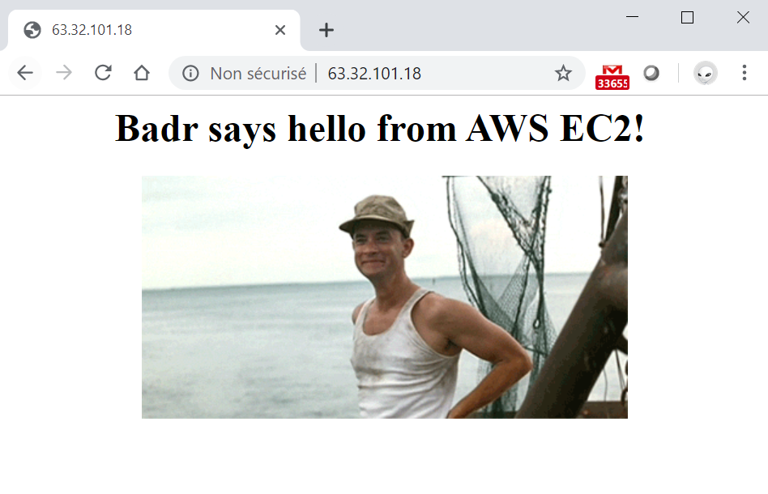
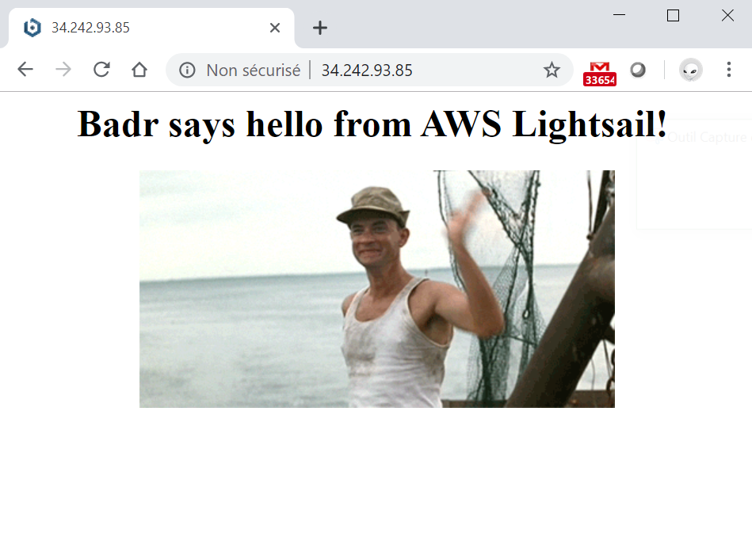

# Building a simple web server in AWS  

In this example I will use Terraform to setup an infrastructure in AWS to host a custom web page. I will do this with two different AWS services: EC2 and Lightsail

## Terraform IaC for AWS
4 terraform files in the game:

`provider.tf` specifies the connection information needed to connect to my AWS account. Comments are available in the code for this part, yet more about how to use AWS provider is available in official terraform doc.

`vars.tf` contains variables declaration that I will be calling in the code.

`main.tf` is where I declare all the resources terraform should create in AWS when applying the code. Comments are available in the code for better understanding.

`outputs.tf` specifies the value I want to print out after the completion of the build, the URL of the web page in in this case, basically it's just a concatenation of "http://" and the public IP of the created for the instance and for Lightsail service.

## Installing nginx and the custom web page

This is something I will be doing while building the VM instance. In fact cloud providers like Azure, AWS and GCP make it possible to run startup scripts that run while creating the instance. Shell scripts can then be used to install packages and make some changes in the configuration.

In this example I will be using 2 scripts:

`StarterEC2.sh` to install nginx and change the default index.html to a customized one.
`StarterLS.sh` to change the default index.html to a customized one since Lightsail comes alredy with a webserver (Nginx for the example)

The Terraform parameter to use to run a startup script in AWS is `user_data =` it takes the script file as a value and it goes within the EC2 instance resource declaration.

## Building the infrastructure with Terraform

First thing to do is to initialize the working directory where terraform code is located with the command terraform init, this will enable terraform to prepare the directory as a terraform workspace and get the necessary plugins to talk with the cloud provider, AWS plugin in this example.

Next thing is to verify the syntax with terraform validate, this is a good step to do in order to check if the code is well written. Although I am using IntelliJ IDE which has the official terraform plugin from Hashicorp that provides auto-complete and performs syntax check, I still use terraform validation as a double check.

One optional step to do before running the code is terraform plane, this gives an idea about what the code will do without really applying it against the cloud provider. This step helps prevent and rework the code for any unwanted results.

Last step is to go ahead and run terraform apply and issue a yes when prompted and Voila! Terraform will do its magic and outputs the URLs for EC2 and Lighsail.

## Accessing the web pages

On EC2:

On Lightsail:

